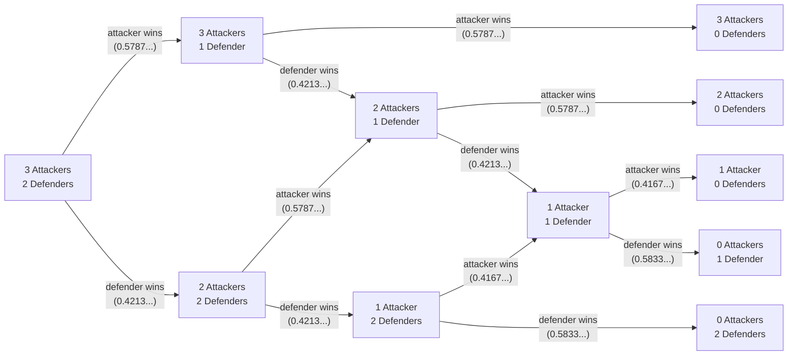

---
hide:
  - tags
tags:
  - window function
  - recursive CTE
  - custom axis
---

# Risk invasions 🛡️

> [!SUCCESS] Scenario
>
> You work for a company that has built a digital version of [Risk, the board game](<https://en.wikipedia.org/wiki/Risk_(game)>). To improve the player experience, the product managers want to add a feature which shows the success likelihood of an invasion.

> [!NOTE]
>
> If you don't know the invasion rules of Risk, check out the following video (06:34 to 08:45):
>
> - [https://youtu.be/Xo8RSozX6Ac?t=394](https://youtu.be/Xo8RSozX6Ac?t=394)

> [!QUESTION]
>
> As a proof of concept, write a query to calculate the outcome likelihoods of an invasion where the attacker is committing 8 troops and the defender is committing 6 troops.
>
> Assume that both the attacker and defender commit the maximum available troops that they can with each battle (attackers commit up to 3 troops, defenders commit up to 2 troops), and that the invasion continues until either the attacker or defender has no troops left.
>
> The output should have a row per possible outcome, which is the different combinations of attacker and defender troops remaining after the invasion has finished.
>
> The output should have the columns:
>
> - `attackers_remaining` as the number of troops the attacker has left
> - `defenders_remaining` as the number of troops the defender has left
> - `likelihood` as the probability of that outcome occurring
> - `attackers_win_likelihood` as the probability of the attacker winning the invasion
> - `defenders_win_likelihood` as the probability of the defender winning the invasion
>
> The likelihoods should be calculated to 10 decimal places.
>
> Order the output by `attackers_remaining` and `defenders_remaining`.

The solution can be found at:

- [risk-invasions.md](../../solutions/gold/risk-invasions.md)

A worked example is provided below to help illustrate the invasion steps.

---

<!-- prettier-ignore -->
>? INFO: **Sample input**
>
> To not give away any spoilers, we'll tweak the rules for this example.
>
> Assume that attackers can commit up to 2 troops and defenders can commit up to 1 troop.
>
> Calculate the outcome likelihoods of an invasion where the attacker is committing 3 troops and the defender is committing 2 troops.

<!-- prettier-ignore -->
>? INFO: **Sample output**
>
> | attackers_remaining | defenders_remaining |   likelihood | attackers_win_likelihood | defenders_win_likelihood |
> |--------------------:|--------------------:|-------------:|-------------------------:|-------------------------:|
> |                   0 |                   1 | 0.1629735937 |             0.7334902409 |             0.2665097591 |
> |                   0 |                   2 | 0.1035361654 |             0.7334902409 |             0.2665097591 |
> |                   1 |                   0 | 0.1164097098 |             0.7334902409 |             0.2665097591 |
> |                   2 |                   0 | 0.2821825544 |             0.7334902409 |             0.2665097591 |
> |                   3 |                   0 | 0.3348979767 |             0.7334902409 |             0.2665097591 |
>
--8<-- "docs/challenging-sql-problems/problems/gold/risk-invasions--sample-output.sql"

<!-- prettier-ignore -->
>? TIP: **Hint 1**
>
> Create (recursive) CTEs for:
>
> - All possible outcomes of each die roll
> - All possible outcomes of each battle
>
> ...and calculate the likelihood of each row in each CTE.

<!-- prettier-ignore -->
>? TIP: **Hint 2**
>
> Use a recursive CTE to walk through all the possible outcomes of an invasion, calculating the likelihood of each outcome.

<!-- prettier-ignore -->
>? TIP: **Hint 3**
>
> Don't track battle outcomes as "win/lose". Instead, track the number of attacks won: an attacker with 3 dice against a defender with 2 dice can win 0, 1, or 2 attacks.

---

### Worked example

To help illustrate the invasion steps, consider the scenario in the **Sample input**.

#### Battle scenarios

Given that attackers can commit up to 2 troops and defenders can commit up to 1 troop, each battle has two scenarios:

1. The attacker commits 2 troops and the defender commits 1 troop.
2. The attacker commits 1 troop and the defender commits 1 troop.

Note that we should only see the second scenario when the attacker has 1 troop remaining as we assume that the attacker commits the maximum available troops with each battle.

First, we'll calculate the likelihood of the attacker winning in each scenario.

##### Attacker commits 2 troops and defender commits 1 troop

Consider all the outcomes of each dice roll.

There are 216 (6 \* 6 \* 6) possible outcomes: 6 for the attacker's first die, 6 for the attacker's second die, and 6 for the defender's die.

The attacker wins if the attacker's highest die is greater than the defender's die.

- When the defender rolls a 6, the attacker always loses: this is 36 of the outcomes.
- When the defender rolls a 5, the attacker wins if the attacker rolls a 6: this is 11 of the outcomes, and the defender wins in the other 25 for this defender roll.
- When the defender rolls a 4, the attacker wins if the attacker rolls a 5 or 6: this is 20 of the outcomes, and the defender wins in the other 16 for this defender roll.
- When the defender rolls a 3, the attacker wins if the attacker rolls a 4, 5, or 6: this is 27 of the outcomes, and the defender wins in the other 9 for this defender roll.
- When the defender rolls a 2, the attacker wins if the attacker rolls a 3, 4, 5, or 6: this is 32 of the outcomes, and the defender wins in the other 4 for this defender roll.
- When the defender rolls a 1, the attacker wins if one of their rolls is not a 1: this is 35 of the outcomes, and the defender wins in the other 1 for this defender roll.

The total number of outcomes where the attacker wins is 0 + 11 + 20 + 27 + 32 + 35 = 125, so the likelihood of the attacker winning is 125 / 216 = 0.578703704.

##### Attacker commits 1 troop and defender commits 1 troop

Consider all the outcomes of each dice roll.

There are 36 (6 \* 6) possible outcomes: 6 for the attacker's die, and 6 for the defender's die.

The attacker wins if the attacker's highest die is greater than the defender's die.

- When the defender rolls a 6, the attacker always loses: this is 6 of the outcomes.
- When the defender rolls a 5, the attacker wins if the attacker rolls a 6: this is 1 of the outcomes, and the defender wins in the other 5 for this defender roll.
- When the defender rolls a 4, the attacker wins if the attacker rolls a 5 or 6: this is 2 of the outcomes, and the defender wins in the other 4 for this defender roll.
- When the defender rolls a 3, the attacker wins if the attacker rolls a 4, 5, or 6: this is 3 of the outcomes, and the defender wins in the other 3 for this defender roll.
- When the defender rolls a 2, the attacker wins if the attacker rolls a 3, 4, 5, or 6: this is 4 of the outcomes, and the defender wins in the other 2 for this defender roll.
- When the defender rolls a 1, the attacker wins if one of their rolls is not a 1: this is 5 of the outcomes, and the defender wins in the other 1 for this defender roll.

The total number of outcomes where the attacker wins is 0 + 1 + 2 + 3 + 4 + 5 = 15, so the likelihood of the attacker winning is 15 / 36 = 0.416666667.

To summarise, we have the following likelihoods for each scenario:

| attackers | defenders | attacks_won | attacks_lost |   likelihood |
| --------: | --------: | ----------: | -----------: | -----------: |
|         1 |         1 |           1 |            0 | 0.4166666667 |
|         1 |         1 |           0 |            1 | 0.5833333333 |
|         2 |         1 |           1 |            0 | 0.5787037037 |
|         2 |         1 |           0 |            1 | 0.4212962963 |

#### Invasion outcomes

An invasion is a series of battles, so we can calculate the likelihood of each outcome by multiplying the likelihoods of each battle.

Starting with the attacker committing 3 troops and the defender committing 2 troops, we have the following possible paths for the invasion:

The likelihood of each branch was calculated in the previous section. We can calculate the likelihood of each outcome by:

1. Multiplying the likelihoods of each branch until we reach the outcome
2. Summing the likelihoods of the paths that lead to the same outcome

We'll walk through two examples.

##### Attacker wins with 3 troops remaining

There is only one path to this outcome: the attacker wins the first battle and the second battle. These each have a likelihood of 0.5787037037, so the likelihood of the attacker winning with 3 troops remaining is:

- 0.5787037037 \* 0.5787037037 = 0.3348979767.

##### Defender wins with 1 troop remaining

There are three paths to this outcome:

1. Attacker wins, defender wins, defender wins, defender wins
2. Defender wins, attacker wins, defender wins, defender wins
3. Defender wins, defender wins, attacker wins, defender wins

Each path has the following likelihood, respectively:

- 0.5787037037 \* 0.4212962963 \* 0.4212962963 \* 0.5833333333 = 0.0599167624
- 0.4212962963 \* 0.5787037037 \* 0.4212962963 \* 0.5833333333 = 0.0599167624
- 0.4212962963 \* 0.4212962963 \* 0.4166666667 \* 0.5833333333 = 0.0431400689

Therefore, the likelihood of the defender winning with 1 troop remaining is:

- 0.0599167624 + 0.0599167624 + 0.0431400689 = 0.1629735937.

Considering all the possible paths, we have the following likelihoods for the invasion:

| attackers_remaining | defenders_remaining |   likelihood |
| ------------------: | ------------------: | -----------: |
|                   0 |                   1 | 0.1629735937 |
|                   0 |                   2 | 0.1035361654 |
|                   1 |                   0 | 0.1164097098 |
|                   2 |                   0 | 0.2821825544 |
|                   3 |                   0 | 0.3348979767 |

#### Invasion winner

Now that we have the likelihoods of each outcome, we can calculate the likelihood of the attacker winning and the defender winning.

The likelihood of the attacker winning is the sum of the likelihoods where the attacker has troops remaining:

- 0.3348979767 + 0.2821825544 + 0.1164097098 = 0.7334902409

Similarly, the likelihood of the defender winning is the sum of the likelihoods where the defender has troops remaining:

- 0.1629735937 + 0.1035361654 = 0.2665097591

As a sense check, we confirm that the likelihoods sum to 1 (accounting for rounding error):

- 0.7334902409 + 0.2665097591 ~ 1

Therefore, the final output is:

| attackers_remaining | defenders_remaining |   likelihood | attackers_win_likelihood | defenders_win_likelihood |
| ------------------: | ------------------: | -----------: | -----------------------: | -----------------------: |
|                   0 |                   1 | 0.1629735937 |             0.7334902409 |             0.2665097591 |
|                   0 |                   2 | 0.1035361654 |             0.7334902409 |             0.2665097591 |
|                   1 |                   0 | 0.1164097098 |             0.7334902409 |             0.2665097591 |
|                   2 |                   0 | 0.2821825544 |             0.7334902409 |             0.2665097591 |
|                   3 |                   0 | 0.3348979767 |             0.7334902409 |             0.2665097591 |
