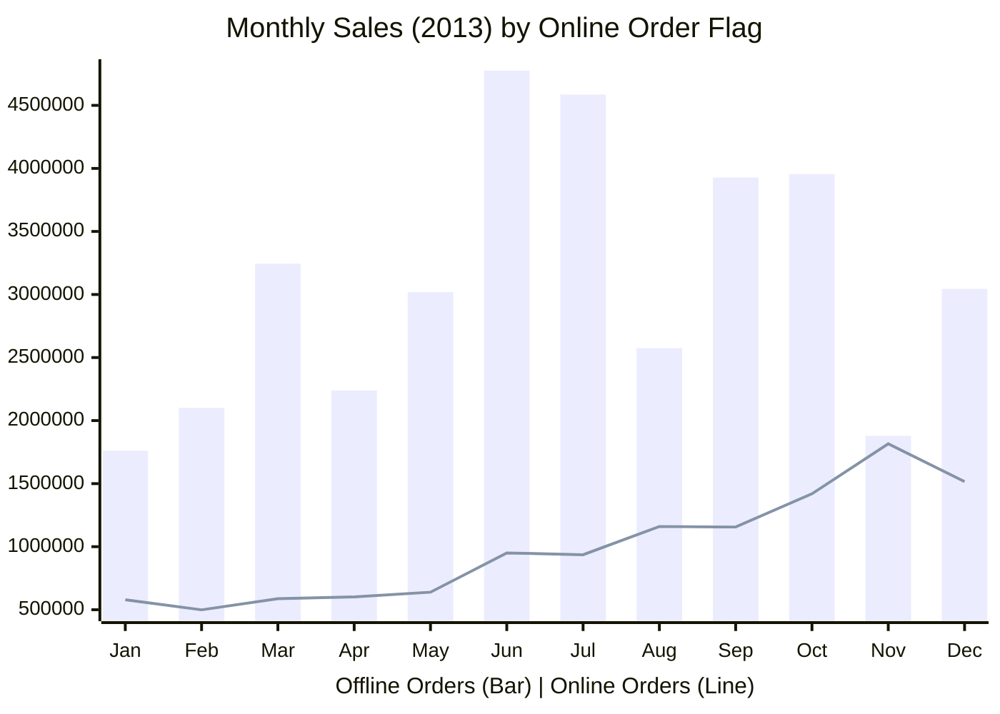

# Aggregations 📊

> [!SUCCESS]
>
> One of the most common ways to use SQL is to aggregate data!

> [!NOTE]
>
> The `GROUP BY` clause is optional. If you use it, it must come after the `WHERE` clause and before the `ORDER BY` clause.

## There are two parts to aggregating data

By now, we know how to get some data, how to filter it, how to sort it, and how to do some simple manipulations on it.

To aggregate rows, use [_aggregate functions_](https://learn.microsoft.com/en-us/sql/t-sql/functions/aggregate-functions-transact-sql) and [the `GROUP BY` clause](https://learn.microsoft.com/en-us/sql/t-sql/queries/select-group-by-transact-sql).

Let's break this down into the two parts: aggregate functions and the `GROUP BY` clause.

## The aggregate functions are how we aggregate the data

> [!INFO]
>
> "Aggregating" data is just a fancy way of saying "summarising" data, such as counting the number of rows, finding the average of a column, finding the maximum value in a column, and so on.

To tell SQL that we want to aggregate rows, we use some of these ["aggregate functions"](https://learn.microsoft.com/en-us/sql/t-sql/functions/aggregate-functions-transact-sql). These functions are used after the `SELECT` clause where we'd normally list the columns.

SQL has a bunch of aggregate functions, but the most common ones are:

- `COUNT`, which counts the number of rows
- `SUM`, which adds up the values in a column
- `AVG`, which finds the average of the values in a column
- `MIN`, which finds the minimum value in a column
- `MAX`, which finds the maximum value in a column

If we want to aggregate/summarise a table, we can just use one of these functions in the `SELECT` clause. For example:

```sql
SELECT
    /* We'll explain these `COUNT` contents below */
    COUNT(*) AS TotalRows,
    COUNT(DISTINCT SalesOrderID) AS TotalOrders,

    AVG(1.0 * OrderQty) AS AverageOrderQuantity,
    SUM(LineTotal) AS TotalSalesAmount,
    MIN(ModifiedDate) AS FirstModifiedDate,
    MAX(ModifiedDate) AS LastModifiedDate
FROM Sales.SalesOrderDetail
;
```

| TotalRows | TotalOrders | AverageOrderQuantity | TotalSalesAmount | FirstModifiedDate       | LastModifiedDate        |
| --------: | ----------: | -------------------: | ---------------: | :---------------------- | :---------------------- |
|    121317 |       31465 |             2.266079 | 109846381.399888 | 2011-05-31 00:00:00.000 | 2014-06-30 00:00:00.000 |

> [!INFO]
>
> Do you remember why we have had to use `1.0 * OrderQty` inside the `AVG` function?
>
> See the [Operators](operators.md#unlike-excel-be-careful-with-division) section for a refresher.

Without the `GROUP BY` clause, these functions will aggregate the entire table, so we get a single row as a result.

However, it's super common to want to aggregate data by some grouping, such as by a category or by a time period. This is where the `GROUP BY` clause comes in!

> [!SUCCESS]
>
> Summarising data like this is like using summary functions in Excel over an entire column, such as `=SUM(A:A)`!

### `COUNT` can be used in a few ways

Before jumping into the `GROUP BY` clause, let's take a closer look at the `COUNT` function. For some column called `COLUMN_NAME`, the main ways to use `COUNT` are described below:

- `COUNT(*)` counts the number of rows in the table/group
- `COUNT(COLUMN_NAME)` counts the number of _non-`NULL`_ values in the column/group
- `COUNT(DISTINCT COLUMN_NAME)` counts the number of unique values in the column/group

Each way of using `COUNT` has its own use case, and you'll see all of them out in the wild.

Let's see these three ways of using `COUNT` in action on the first 10 people in the `Person.Person` table:

```sql
SELECT
    BusinessEntityID,
    FirstName,
    MiddleName,
    LastName
FROM Person.Person
WHERE BusinessEntityID <= 10
;
```

| BusinessEntityID | FirstName | MiddleName | LastName   |
| ---------------: | :-------- | :--------- | :--------- |
|                1 | Ken       | J          | Sánchez    |
|                2 | Terri     | Lee        | Duffy      |
|                3 | Roberto   | _null_     | Tamburello |
|                4 | Rob       | _null_     | Walters    |
|                5 | Gail      | A          | Erickson   |
|                6 | Jossef    | H          | Goldberg   |
|                7 | Dylan     | A          | Miller     |
|                8 | Diane     | L          | Margheim   |
|                9 | Gigi      | N          | Matthew    |
|               10 | Michael   | _null_     | Raheem     |

The `MiddleName` has a variety of values, including `NULL`. Here are the results of the three ways of using `COUNT` on this column for these rows:

```sql
SELECT
    COUNT(*) AS ROW_COUNT,
    COUNT(MiddleName) AS NON_NULL_COUNT,
    COUNT(DISTINCT MiddleName) AS DISTINCT_COUNT
FROM Person.Person
WHERE BusinessEntityID <= 10
;
```

| ROW_COUNT | NON_NULL_COUNT | DISTINCT_COUNT |
| --------: | -------------: | -------------: |
|        10 |              7 |              6 |

The `ROW_COUNT` is just the number of rows, which is 10. The `NON_NULL_COUNT` is the number of non-`NULL` values, which is 7. The `DISTINCT_COUNT` is the number of unique values, which is 6. In particular, they are:

- `J`
- `Lee`
- `A`
- `H`
- `L`
- `N`

Note how the `NULL` values _are not counted_ in the `DISTINCT_COUNT` -- this is a common behaviour in SQL.

> [!TIP]
>
> Since each of the ways above has a different use case, make sure you use the right one for your needs!

## The `GROUP BY` clause summarises data by a category (or categories)

> [!NOTE]
>
> To tell SQL that we want to aggregate rows by a category (or categories), we use the `GROUP BY` clause. This clause comes after the `WHERE` clause and before the `ORDER BY` clause.

The examples above are just producing a single row with the "overall" aggregate/summary values.

Using the `GROUP BY` clause allows us to group the data by one or more columns.

To help illustrate why this is helpful, it might be useful to think about what kind of questions you can answer with this.

Without the `GROUP BY` clause, the kinds of questions you can answer are things like:

- "_What are the total sales **over all orders**?_"
- "_What is the average order quantity **over all orders**?_"
- "_What is the minimum and maximum unit price **over all orders**?_"

With the `GROUP BY` clause, you can answer questions like:

- "_What are the total sales **per order**?_"
- "_What is the average order quantity **per month**?_"
- "_What is the minimum and maximum unit price **per product**?_"

To see this in action, the example above can be adjusted to group by the `SalesOrderID` column which would give us the summary statistics _for each order_:

```sql
SELECT TOP 5
    SalesOrderID,

    COUNT(*) AS TotalRowsInOrder,
    AVG(1.0 * OrderQty) AS AverageOrderQuantity,
    SUM(OrderQty) AS TotalItemsOrdered,
    SUM(LineTotal) AS TotalSalesAmount,
    MIN(UnitPrice) AS CheapestItemPrice,
    MAX(UnitPrice) AS MostExpensiveItemPrice
FROM Sales.SalesOrderDetail
GROUP BY SalesOrderID
;
```

| SalesOrderID | TotalRowsInOrder | AverageOrderQuantity | TotalItemsOrdered | TotalSalesAmount | CheapestItemPrice | MostExpensiveItemPrice |
| -----------: | ---------------: | -------------------: | ----------------: | ---------------: | ----------------: | ---------------------: |
|        43659 |               12 |             2.166666 |                26 |     20565.620600 |            5.1865 |              2039.9940 |
|        43660 |                2 |             1.000000 |                 2 |      1294.252900 |          419.4589 |               874.7940 |
|        43661 |               15 |             2.533333 |                38 |     32726.478600 |            5.1865 |              2039.9940 |
|        43662 |               22 |             2.454545 |                54 |     28832.528900 |          178.5808 |              2146.9620 |
|        43663 |                1 |             1.000000 |                 1 |       419.458900 |          419.4589 |               419.4589 |

## Calculated columns need to be "re-calculated" in the `GROUP BY` clause

> [!INFO]
>
> This is not the case for many SQL dialects, but it is for Microsoft SQL Server.

If you want to group by a column that is calculated in the `SELECT` clause, you need to repeat the calculation in the `GROUP BY` clause.

For example, if we wanted to aggregate the sales by the order month, we would need to convert the order date into a month both in the `SELECT` and the `GROUP BY` lists:

```sql
SELECT
    FORMAT(OrderDate, 'yyyy-MM') AS OrderMonth,
    SUM(TotalDue) AS TotalSales
FROM Sales.SalesOrderHeader
WHERE YEAR(OrderDate) = 2013
GROUP BY FORMAT(OrderDate, 'yyyy-MM')
ORDER BY OrderMonth
;
```

| OrderMonth |   TotalSales |
| :--------- | -----------: |
| 2013-01    | 2340061.5521 |
| 2013-02    | 2600218.8667 |
| 2013-03    | 3831605.9389 |
| 2013-04    | 2840711.1734 |
| 2013-05    | 3658084.9461 |
| 2013-06    | 5726265.2635 |
| 2013-07    | 5521840.8445 |
| 2013-08    | 3733973.0032 |
| 2013-09    | 5083505.3374 |
| 2013-10    | 5374375.9418 |
| 2013-11    | 3694667.9998 |
| 2013-12    | 4560577.0958 |

Remember that we _don't_ need to repeat the calculation in the `ORDER BY` clause though -- it's one of the few places where we can use the alias.

## You can group by one or more columns

To group by more than one column, list the columns in the `GROUP BY` clause!

The example below is a more involved query to show how we can calculate the total sales for each month in 2013, split by whether the order was placed online or not:

```sql
SELECT
    FORMAT(OrderDate, 'yyyy-MM') AS OrderMonth,
    OnlineOrderFlag,
    SUM(TotalDue) AS TotalSales
FROM Sales.SalesOrderHeader
WHERE YEAR(OrderDate) = 2013
GROUP BY
    FORMAT(OrderDate, 'yyyy-MM'),
    OnlineOrderFlag
ORDER BY
    OrderMonth,
    OnlineOrderFlag
;
```

| OrderMonth | OnlineOrderFlag |   TotalSales |
| :--------- | :-------------- | -----------: |
| 2013-01    | false           | 1761132.8322 |
| 2013-01    | true            |  578928.7199 |
| 2013-02    | false           | 2101152.5476 |
| 2013-02    | true            |  499066.3191 |
| 2013-03    | false           | 3244501.4287 |
| 2013-03    | true            |  587104.5102 |
| 2013-04    | false           | 2239156.6675 |
| 2013-04    | true            |  601554.5059 |
| 2013-05    | false           | 3019173.6253 |
| 2013-05    | true            |  638911.3208 |
| 2013-06    | false           | 4775809.3027 |
| 2013-06    | true            |  950455.9608 |
| 2013-07    | false           | 4585752.5978 |
| 2013-07    | true            |  936088.2467 |
| 2013-08    | false           | 2573825.2983 |
| 2013-08    | true            | 1160147.7049 |
| 2013-09    | false           | 3927650.1373 |
| 2013-09    | true            | 1155855.2001 |
| 2013-10    | false           | 3954900.7112 |
| 2013-10    | true            | 1419475.2306 |
| 2013-11    | false           | 1878956.5046 |
| 2013-11    | true            | 1815711.4952 |
| 2013-12    | false           | 3044875.2799 |
| 2013-12    | true            | 1515701.8159 |

Although SQL itself doesn't have any graphing capabilities, this would be easy to drop into Excel or a similar tool to create a graph like the one below!



## You can filter the aggregated rows with `HAVING`

> [!NOTE]
>
> The `HAVING` clause is optional. If you use it, it must come after the `GROUP BY` clause.

A handy way to filter the aggregated rows is to use the `HAVING` clause. This clause is similar to the `WHERE` clause, but it filters the _aggregated_ rows -- that is, it does the filtering after the aggregation.

To use the `HAVING` clause, add it after the `GROUP BY` clause. For example, we could extend the monthly summary example above to keep only the months when the total sales were more than $5m:

```sql
SELECT
    FORMAT(OrderDate, 'yyyy-MM') AS OrderMonth,
    SUM(TotalDue) AS TotalSales
FROM Sales.SalesOrderHeader
WHERE YEAR(OrderDate) = 2013
GROUP BY FORMAT(OrderDate, 'yyyy-MM')
HAVING SUM(TotalDue) > 5000000
ORDER BY OrderMonth
;
```

| OrderMonth |   TotalSales |
| :--------- | -----------: |
| 2013-06    | 5726265.2635 |
| 2013-07    | 5521840.8445 |
| 2013-09    | 5083505.3374 |
| 2013-10    | 5374375.9418 |

> [!WARNING]
>
> There are two things to be careful of with the `HAVING` clause:
>
> 1. This is similar to the `WHERE` clause, but it is not the same. Reserve it for filtering by aggregated values and continue to use the `WHERE` clause for filtering the original/underlying rows.
> 2. You cannot use column aliases in the `HAVING` clause, so you need to repeat the calculation.

## Further reading

Check out the [official Microsoft documentation](https://learn.microsoft.com/en-us/sql/t-sql/queries/select-group-by-transact-sql) for more information on the `GROUP BY` clause at:

- [https://learn.microsoft.com/en-us/sql/t-sql/queries/select-group-by-transact-sql](https://learn.microsoft.com/en-us/sql/t-sql/queries/select-group-by-transact-sql)
- [https://learn.microsoft.com/en-us/sql/t-sql/functions/aggregate-functions-transact-sql](https://learn.microsoft.com/en-us/sql/t-sql/functions/aggregate-functions-transact-sql)

### Additional modifiers

The `GROUP BY` clause also has additional modifiers including `ROLLUP`, `GROUPING SETS`, and `CUBE`. We'll see `ROLLUP` in [the next section](rollup.md) and both `GROUPING SETS` and `CUBE` and [the advanced aggregations section](../advanced-concepts/advanced-aggregations.md).
